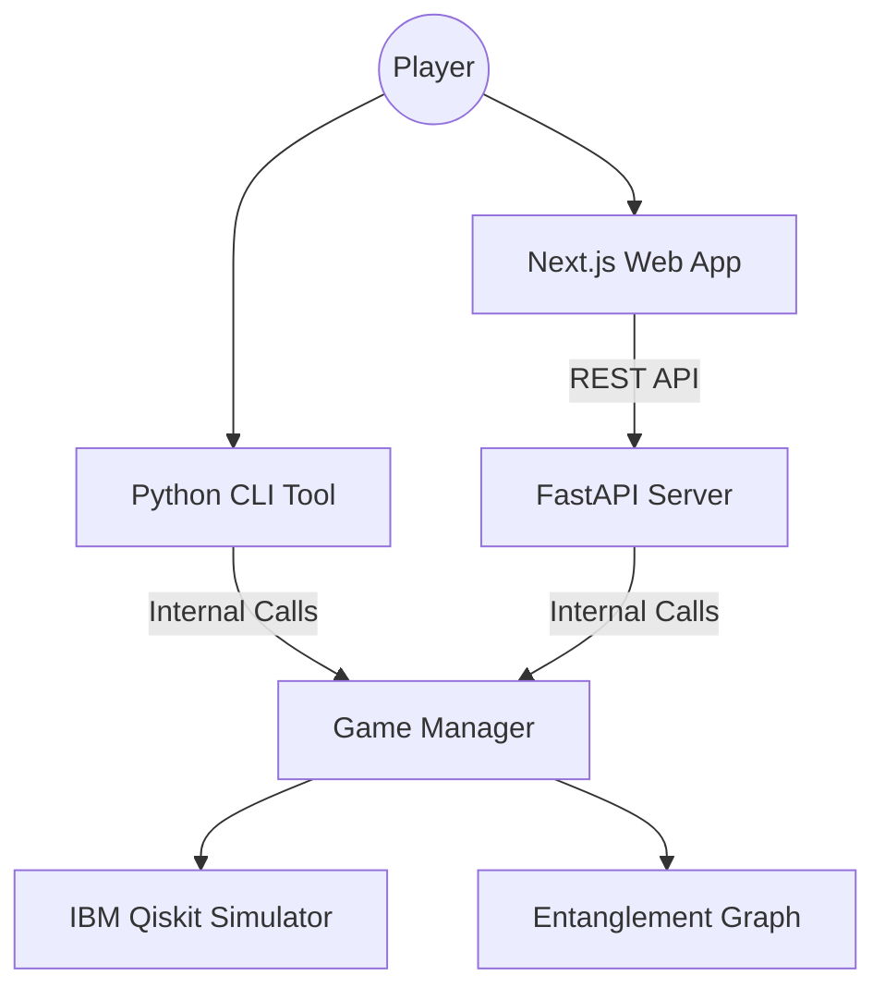

# ⚛️ Quantum Tic-Tac-Toe

A high-stakes, physics-inspired strategic board game built with **FastAPI**, **Next.js**, and **IBM Qiskit**. Forget classic Tic-Tac-Toe—this is a battle of superposition, entanglement, and the collapse of reality itself.


## 🌌 The Concept

Quantum Tic-Tac-Toe generalizes the classic game using the principles of quantum mechanics. In this version, players don’t just claim a square—they exist in two places at once (**Superposition**). Reality only takes shape when the universe is forced to choose, collapsing the quantum web into a definitive victory or a chaotic draw.

### Key Mechanics:
- **Superposition**: Each move involves selecting two squares. Your mark exists in both until a measurement occurs.
- **Entanglement**: Moves sharing the same square become "entangled." A collapse in one square instantly affects all connected squares across the board.
- **Cycle Collapse**: When a closed loop of moves is formed, the **Wavefunction Collapses**, and every square in the cycle resolves to a single classical 'X' or 'O'.

---

## 🏗 Architecture

The project follows a modern, decoupled Monorepo architecture:



---

## 🚀 Getting Started

### Prerequisites:
- Python 3.10+
- Node.js 18+
- npm or yarn

### 1. Setup the Backend (Engine)
```bash
cd backend
python -m venv venv
source venv/bin/activate  # Or venv\Scripts\activate on Windows
pip install -r requirements.txt
uvicorn api:app --reload
```

### 2. Setup the Frontend (UI)
```bash
cd frontend
npm install
npm run dev
```

Visit [http://localhost:3000](http://localhost:3000) to start your first quantum match.

---

## 🤖 Fierce Quantum AI
The game includes a specialized AI agent using the **Parasite Strategy**. Instead of heavy-handed simulations, it uses graph-heuristic analysis to prioritize:
1. **Winning**: Completing cycles that resolve in its favor.
2. **Disruption**: Entangling your potential winning lines to "poison" them with uncertainty.
3. **Complexity**: Forcing large-scale collapses that are difficult for humans to calculate.

---

## 🛠 Tech Stack
- **Frontend**: Next.js, TailwindCSS, TypeScript, Framer Motion.
- **Backend**: FastAPI, Pydantic, Python.
- **Quantum Engine**: IBM Qiskit (Aer Simulator) for move resolution.
- **Graph Logic**: Custom Cycle-Detection Algorithm via NetworkX-style adjacency maps.

---

## 🤝 Contribution
Contributions are welcome! If you find a bug in the quantum logic or want to improve the UI animations, please open a PR.

---

## 📄 License
This project is open-source and available under the **MIT License**.
