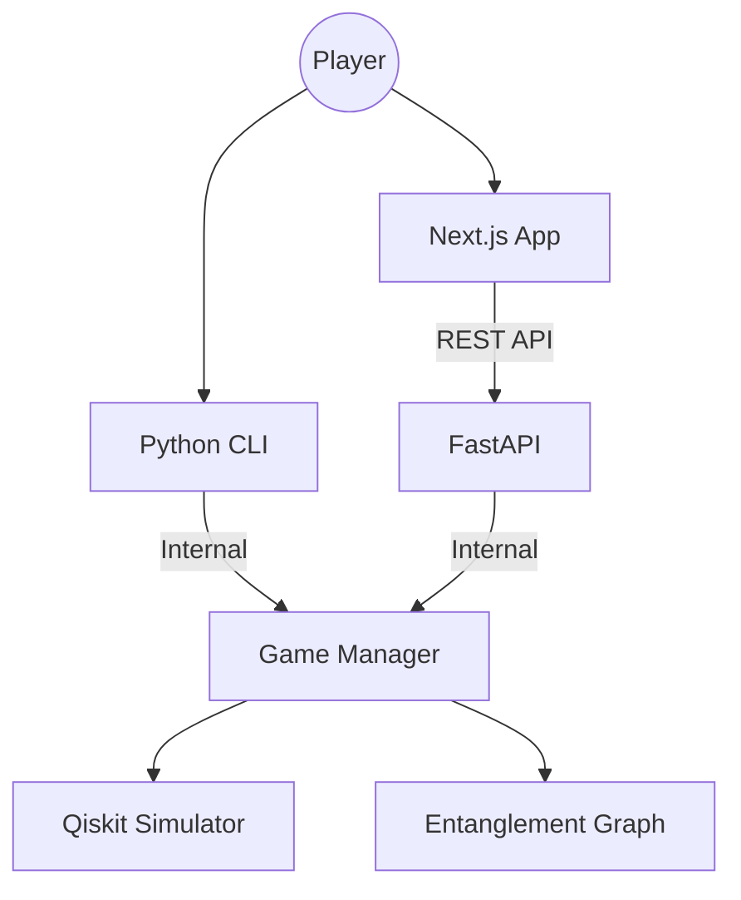
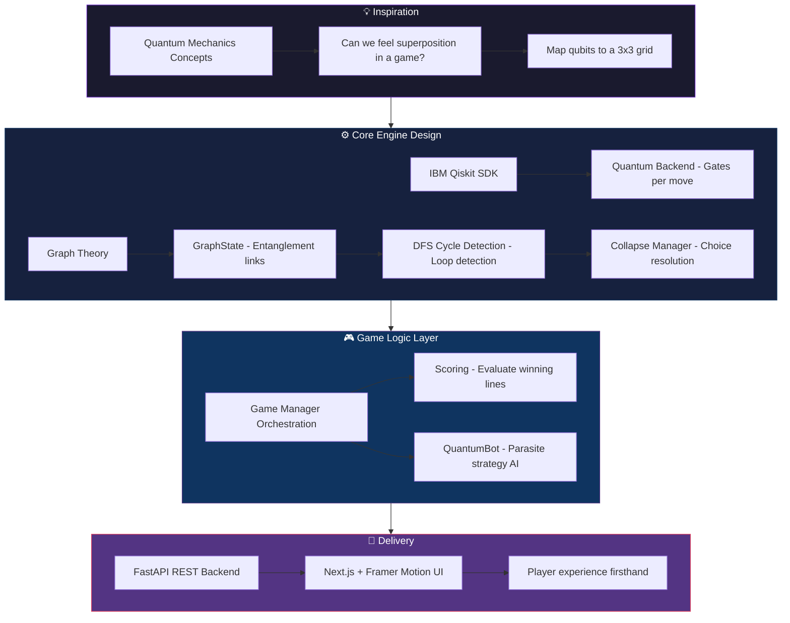

# ⚛️ Quantum Tic-Tac-Toe

A high-stakes, physics-inspired strategic board game built with **FastAPI**, **Next.js**, and **IBM Qiskit**. Forget classic Tic-Tac-Toe—this is a battle of superposition, entanglement, and the collapse of reality itself.


### 🎥 Live Simulation
<video src="frontend/public/simulation.webm" width="100%" controls autoplay loop muted></video>

[](https://reactjs.org/)
[](https://nextjs.org/)
[](https://www.python.org/)
[](https://qiskit.org/)
[](https://opensource.org/licenses/MIT)

---

## 🌌 Important Mentality

Forget everything you know about Tic-Tac-Toe. This isn't just a game of X’s and O’s; it’s a high-stakes battle of **probabilities, superposition, and entanglement**. In this version, players don’t just claim a square—they exist in two places at once (**Superposition**). Reality only takes shape when the universe is forced to choose, collapsing the quantum web into a definitive victory or a chaotic draw.

## 🧠 The "Why"

Quantum mechanics is often referred to as a series of abstract equations in a textbook. I built this to understand how the concepts of superposition, entanglement, and quantum measurement can be modeled in a web environment. By mapping quantum states to a familiar 3x3 grid, players can *feel* the Spooky Action at a Distance™ and understand how measurement fundamentally alters the state of a system. Shout out to the OAU quantum computing community for inspiring this project

---

## 🛠️ How it Works (The Physics & Logic)

This project models complex quantum phenomena using Python and the IBM Qiskit SDK. Here is the technical breakdown of how the physics is translated into code.

### 1. Superposition
In quantum mechanics, **Superposition** is the phenomenon where a particle can exist in multiple states simultaneously until it is observed. In this game, every move is a "Spooky Move" that spans two squares.

We model this by assigning a **Move Qubit** to every turn. We use a **Hadamard Gate** (`h`) to put this move into a state of 0 and 1 at the same time, and then link it to the grid squares using **Controlled-NOT (CNOT)** gates.

**From `backend/q_backend.py`:**
```python
def make_spooky_move(self, move_index: int, s1: int, s2: int):
    # Step 1: Create superposition on the move qubit
    self.circuit.h(self.move_reg[move_index])
    
    # Step 2: Entangle the move qubit with Square 1
    self.circuit.cx(self.move_reg[move_index], self.grid_reg[s1])
    
    # Step 3: Flip the move qubit and entangle with Square 2
    # This creates the "Either Square 1 OR Square 2" logic
    self.circuit.x(self.move_reg[move_index])
    self.circuit.cx(self.move_reg[move_index], self.grid_reg[s2])
```

### 2. Entanglement & The Graph
**Entanglement** occurs when qubits become linked such that the state of one instantly depends on the state of another, regardless of distance. In this game, entanglement happens naturally when different moves share the same square.

If move **A** is in squares (1, 2) and move **B** is in squares (2, 3), they are now entangled through square 2. If square 2 eventually collapses to move **A**, move **B** is "pushed" into square 3.

We model this entire web of relationships as an **undirected graph**. Every square on the 3×3 grid is a **node** (0–8), and every spooky move creates an **edge** between the two squares it occupies. The graph is stored as a simple adjacency list.

**From `backend/collapse_manager.py` — `GraphState`:**
```python
class GraphState:
    """Manages the graph representation of quantum entanglement."""

    def __init__(self) -> None:
        # Initialize an empty adjacency list for all 9 squares
        self.adj: Dict[int, List[Tuple[int, int]]] = {i: [] for i in range(9)}

    def add_edge(self, u: int, v: int, move_id: int) -> None:
        """Adds a move edge between two squares in the graph."""
        if v not in [edge[0] for edge in self.adj[u]]:
            self.adj[u].append((v, move_id))
            self.adj[v].append((u, move_id))
```

Every time a player makes a spooky move, the `GameManager` calls `graph.add_edge(s1, s2, move_index)`. As the game progresses, this adjacency list grows into a dense web of connections—the "Entanglement Graph."

### 3. Cycle Detection — The DFS Algorithm

The most critical question in the game is: **"Has a closed loop formed?"** A cycle means reality has become self-referential—the universe *must* now choose. We answer this question using a **stack-based Depth-First Search (DFS)** that runs after every single move.

The algorithm works like this:
1. Start at any unvisited node on the graph.
2. Walk along edges, pushing neighbors onto a stack and recording each node's parent.
3. If we encounter a node that has **already been visited** and it is **not the node we just came from**, we have found a cycle.
4. Backtrack through the parent chain to reconstruct the exact loop of moves that caused it.

**From `backend/collapse_manager.py` — `detect_cycle`:**
```python
def detect_cycle(self) -> Optional[List[Tuple[int, int, int]]]:
    """Detects a cycle in the current graph state."""
    visited: Set[int] = set()
    parent: Dict[int, Tuple[Optional[int], Optional[int]]] = {}

    def get_cycle_info(start, end, last_move_id):
        # Backtrack through parent chain to reconstruct the cycle
        moves = [(start, end, last_move_id)]
        curr = start
        while curr != end:
            p, m_id = parent[curr]
            if p is None or m_id is None: break
            moves.append((p, curr, m_id))
            curr = p
        return moves

    for i in range(9):  # Check all 9 squares
        if i not in visited:
            stack = [(i, None, None)]  # (node, parent, move_id)
            while stack:
                curr, p, m_id = stack.pop()
                if curr not in visited:
                    visited.add(curr)
                    parent[curr] = (p, m_id)
                    for neighbor, edge_m_id in self.adj[curr]:
                        if neighbor == p: continue     # Don't walk backwards
                        if neighbor in visited:         # ← CYCLE FOUND!
                            return get_cycle_info(curr, neighbor, edge_m_id)
                        stack.append((neighbor, curr, edge_m_id))
    return None  # No cycle exists yet
```

When a cycle *is* found, the function returns the exact list of moves (as `(square_a, square_b, move_id)` tuples) that form the loop. This is then passed to the collapse engine.

### 4. Measurement & State Collapse
In quantum computing, **Measurement** is the act of observing a qubit, which forces it to "collapse" from a probability cloud into a definitive classical state (0 or 1). In our game, measurement is only triggered when the DFS algorithm above detects a cycle.

Once a cycle is detected, the engine uses the Qiskit `QasmSimulator` to make the quantum "coin flip" that decides reality. The first move in the cycle is put into superposition with a Hadamard gate, measured, and the resulting bit determines which orientation the entire chain collapses into.

**From `backend/collapse_manager.py` — `trigger_collapse`:**
```python
def trigger_collapse(backend, cycle_moves):
    """Resolves a quantum cycle into a classical state using a simulator."""
    if not cycle_moves:
        return {}

    # Pick a reality using a quantum superposition
    picker_id = cycle_moves[0][2]
    backend.circuit.h(backend.move_reg[picker_id])      # Superposition
    backend.circuit.measure(
        backend.move_reg[picker_id],
        backend.move_cl_reg[picker_id]                   # Measure → 0 or 1
    )
    
    # Run on IBM's QasmSimulator (1 shot = 1 reality)
    simulator = QasmSimulator()
    transpiled = transpile(backend.circuit, simulator)
    job = simulator.run(transpiled, shots=1)
    result = job.result()
    bitstring = list(result.get_counts().keys())[0]
    
    # Parse the measured bit to determine the collapse orientation
    parts = bitstring.split()
    move_bits = parts[0] if len(parts) > 1 else bitstring
    choice = int(move_bits[::-1][picker_id])  # 0 or 1
    
    # Resolve every move in the cycle based on the quantum choice
    resolution = {}
    for u, v, m_id in cycle_moves:
        resolution[m_id] = u if choice == 1 else v  # Assign square
    return resolution
```

The result is a dictionary mapping each move to the single square it now definitively occupies. The `GameManager` then converts each "ghost" mark into a solid, classical mark on the board and strips the resolved marks from all other squares.

---

## 🏗 Architecture

The project follows a modern, decoupled Monorepo architecture:



---

## 🧩 Thought Process Diagram

This diagram models the high-level thinking behind bringing the entire system together—from the initial physics concepts to the final playable web application.



## 🎮 How to Play (Strategy Guide)

Quantum Tic-Tac-Toe is a game of management, not just positioning. To win, you must master the "Chain."

### Basic Rules
1. **Choose Two Squares**: On your turn, click any two squares. Your mark will appear in both in a "spooky" (faded) state.
2. **Form a Cycle**: You win by getting three of your collapsed marks in a row. However, marks only collapse when a cycle is formed.
3. **The Collapse**: When a cycle forms, the **Quantum Simulator** determines the outcome based on probability, resolving every square in the cycle to a classical 'X' or 'O'.

### Tips to Win
- **The "Parasite" Strategy**: Don't just try to build your own lines. Entangle your moves with your opponent's "hot" squares. By doing this, you force them into a collapse where they might lose their position.
- **Aggressive Cycling**: If you have two marks near each other, try to close a cycle as fast as possible. The sooner you force a measurement, the sooner your marks become "real."
- **Expert Positioning**: Beginners stay safe in empty squares. Experts embrace entanglement; the person who controls the largest "web" usually controls the final collapse.

---

## 🤖 Fierce Quantum AI (PvE Mode)

The AI doesn't use simple Minimax. It uses the **Parasite Strategy**—a heuristic approach that analyzes the live **Entanglement Graph** to aggressively hijack your superposition web. It operates on three strict priorities:

1. **Winning Path**: Scan all win-lines for squares where the bot already has ghost marks. If two bot-marked squares exist in a single line, close the loop.
2. **Disruption (Blocking)**: If the opponent is building a dangerous line, the bot "parasites" onto their hot squares—entangling its own mark there to poison the eventual collapse.
3. **Complexity (Graph Centrality)**: When no immediate win or block exists, the bot targets the **most connected node** in the entanglement graph, maximizing its influence over future collapses.

**From `backend/bot_player.py`:**
```python
def get_move(self, board, graph, valid_squares):
    """Calculates the best two squares to entangle using heuristic priorities."""
    # Random blunder chance for difficulty tuning
    if random.random() < self.mistake_chance:
        return tuple(random.sample(valid_squares, 2))

    # Priority 1: Winning Path
    for line in self.win_lines:
        my_marks = [s for s in line if self._has_mark(board[s], self.mark)]
        valid_my_marks = [s for s in my_marks if s in valid_squares]
        if len(valid_my_marks) >= 2:
            return tuple(random.sample(valid_my_marks, 2))

    # Priority 2: Disruption (Blocking)
    for line in self.win_lines:
        op_marks = [s for s in line if self._has_mark(board[s], self.opponent_mark)]
        if len(op_marks) >= 2:
            target = random.choice([s for s in op_marks if s in valid_squares] or [None])
            if target is not None:
                others = [s for s in valid_squares if s != target]
                if others:
                    return (target, random.choice(others))

    # Priority 3: Complexity — target the most connected node
    degrees = {s: len(graph.adj[s]) for s in valid_squares}
    if degrees:
        max_deg = max(degrees.values())
        candidates = [s for s, d in degrees.items() if d == max_deg]
        target = random.choice(candidates)
        others = [s for s in valid_squares if s != target]
        if others:
            return (target, random.choice(others))
```

The bot also has a configurable `mistake_chance` (default 10%) that introduces occasional random blunders, keeping the AI challenging but beatable.

---

## 🚀 Getting Started

### Prerequisites:
- Python 3.10+
- Node.js 18+
- npm or yarn

### 1. Setup & Run Backend
First, install the dependencies and set up the environment:
```bash
cd backend
python -m venv venv
source venv/bin/activate  # Or venv\Scripts\activate on Windows
pip install -r requirements.txt
```

Now you can start the backend anytime using the shortcut script:
```bash
./run.sh
```

### 2. Setup the Frontend
Configure your environment variables first:
```bash
cd frontend
cp .env.example .env.local
npm install
npm run dev
```

Visit [http://localhost:3000](http://localhost:3000) to start your first quantum match.

---

## 🛠 Tech Stack
- **Frontend**: Next.js, TailwindCSS, TypeScript, Framer Motion.
- **Backend**: FastAPI, Pydantic, Python.
- **Quantum Engine**: IBM Qiskit (Aer Simulator) for move resolution.
- **Graph Logic**: Custom Cycle-Detection Algorithm via adjacency maps.

---

## 🔑 Environment Configuration

To keep the codebase secure and flexible, all external links and API configurations are managed via environment variables.

### Frontend (`frontend/`)
Create a `.env.local` file (or copy from `.env.example`):
- `NEXT_PUBLIC_API_URL`: The full URL of your backend (default for local: `http://127.0.0.1:8000`).

### Backend (`backend/`)
- `PORT`: (Optional) The port used by the FastAPI server (default: `8000`). This is automatically handled by Render during deployment.

---

## 🌐 Deployment Checklist

To ensure a seamless deployment without "Quantum Anomalies" (connection conflicts), follow these settings:

### 1. Backend (Render)
- **Service Type**: Web Service
- **Root Directory**: `backend`
- **Build Command**: `pip install --upgrade pip && pip install -r requirements.txt`
- **Start Command**: `bash run.sh` (The script automatically detects the Render `$PORT`)
- **Environment Variables**:
  - `PYTHON_VERSION`: `3.10` or higher

### 2. Frontend (Vercel)
- **Framework Preset**: Next.js
- **Root Directory**: `frontend`
- **Environment Variables**:
  - `NEXT_PUBLIC_API_URL`: Set this to your **Render Service URL** (e.g., `https://quantum-backend.onrender.com`).
  - *Note: Do not include a trailing slash.*

> [!IMPORTANT]
> **CORS Handling**: The backend is configured to allow all origins (`*`) by default to ensure Vercel can communicate with Render. For a production environment, it is recommended to restrict `allow_origins` in `backend/api.py` to your specific Vercel URL.

---

## 🤝 Contribution
Contributions are welcome! If you find a bug in the quantum logic or want to improve the UI animations, please open a PR.

---

## 📄 License
This project is open-source and available under the **MIT License**.

Built with love for the **Quantum Community**.
